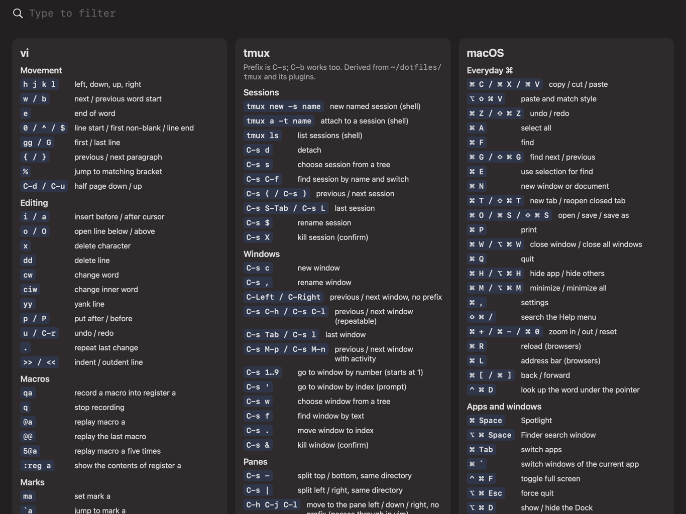
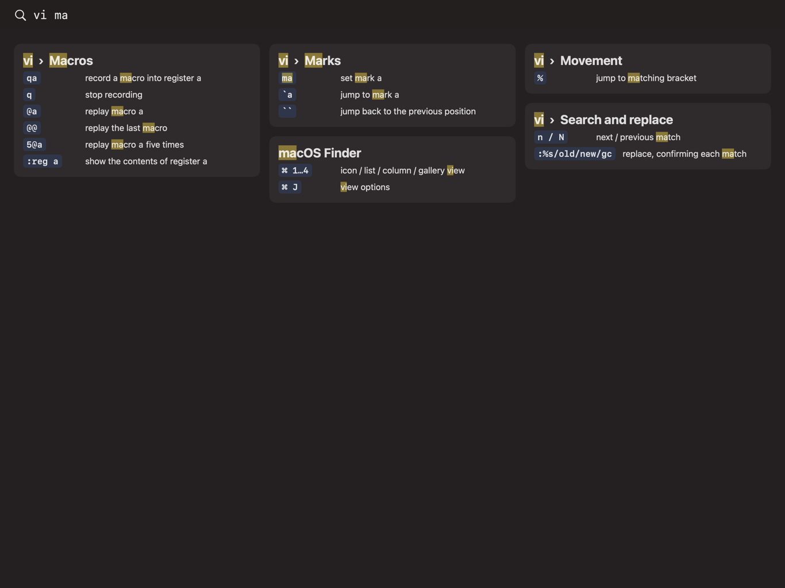

# cheatmd

An always-fullscreen macOS app that shows your keyboard-shortcut cheat sheet, a plain
hierarchical markdown file at `~/.config/cheatmd/cheatmd.md`, and fuzzy-filters it as you type:
`vi ma` brings up the vi macro shortcuts, highlighted. Built for a 13" iPad used as a Sidecar
display. Bind a global hotkey to `open -a cheatmd` with your tool of choice.



Typing filters as you go; `vi ma` brings the vi macros and marks to the front:



## Use

| Key | Does |
|---|---|
| type | filter: every word must start a word in the heading path, keys or description (`vi ma`) |
| Backspace | delete the last character |
| Esc | clear the query; on an empty query, return to the previous app |
| Return | return to the previous app, leaving the results on screen |
| ⌘ + / ⌘ − / ⌘ 0 | zoom in / out / reset |
| ⌃ ⌘ → | move to the next display (put it on the iPad once; it remembers) |

The sheet is plain markdown: headings nest, and a list item that starts with a code span
(`` - `qa` record macro ``) or a row of a two-column table is a shortcut. Edit it in any
editor; the app reloads within a second.

Status: all requirements implemented; manual checks pending, see [TODO.md](TODO.md). Contributors and agents start at
[AGENTS.md](AGENTS.md).

```sh
tools/check.sh      # every gate: traceability, format, lint, tests, coverage, app build
```
